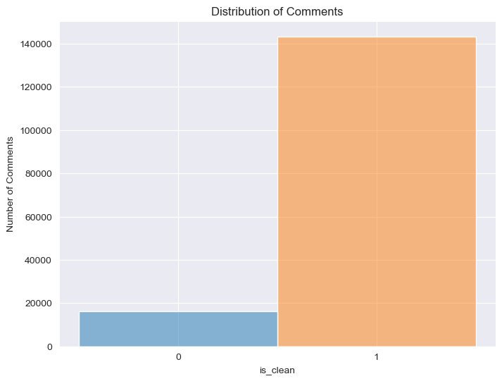
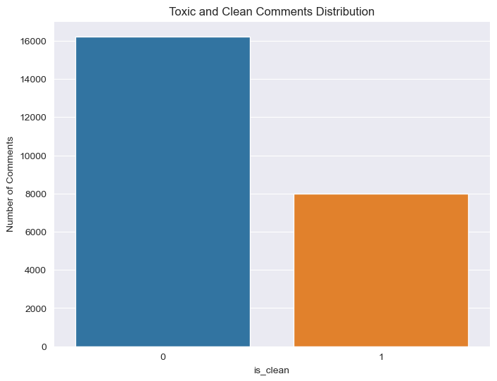
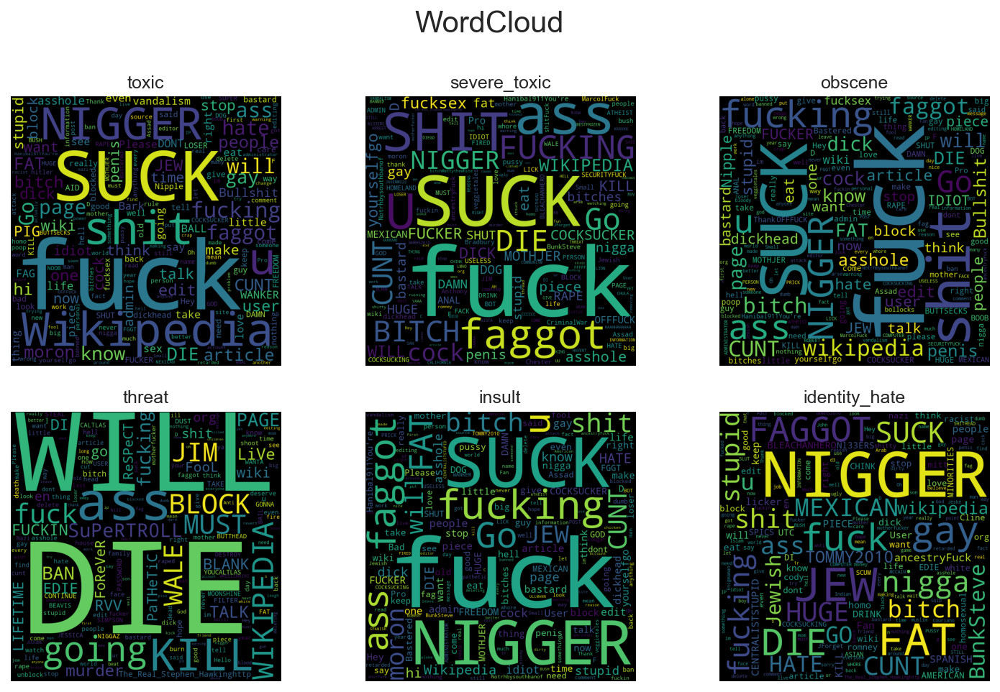
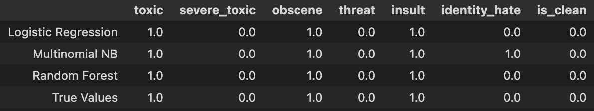
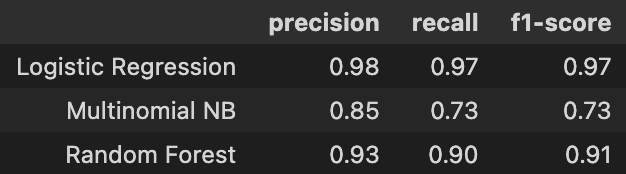
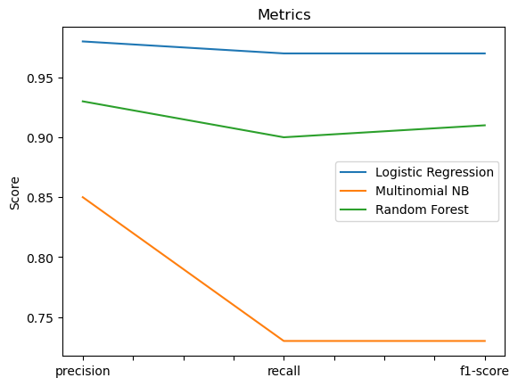

# Toxic Comment Classification
## 1. Problem Identification
___

Discussing things you care about can be difficult. The threat of abuse and harassment online means that many people stop expressing themselves and give up on seeking different opinions. Platforms struggle to effectively facilitate conversations, leading many communities to limit or completely shut down user comments.

## 1.1 Objective
___

The goal is to build a multi-headed model that's capable of detecting differnt types of toxicity like threats, obscenity, insults, and identity-based hate. 

## 2. Data
___

We'll be using a dataset of comments from Wikipedia's talk page edits stored on Kaggle.

_Disclaimer: The dataset for this project contains text that may be considered profane, vulgar, or offensive_/

- [Kaggle dataset](https://www.kaggle.com/competitions/jigsaw-toxic-comment-classification-challenge/data)

## 2.1 File Descriptions
___

* **train.csv** - The training set, contains comments with their binary labels.
* **tet.csv** - The test set, you must predict the toxicity probabilities for these comments. The test set contains some comments whish are not included in scoring.
* **test_labels.csv** - Labels for the test data; value of `-1` indicates it was not used for scoring. 

## 3. Data Cleaning
___

The dataset from [Kaggle](https://www.kaggle.com/competitions/jigsaw-toxic-comment-classification-challenge/data) was pretty much clean. I analyzed datatypes of each column on the DataFrame. The column containing the comment text is the one we care. The other columns are the labels pre-assigned for training. The initial raw data has a total of 159,571 entries.
In addition, the dataset does not contain any `Nan` values. A random comment would like like this:

`'Chiropractic edits\n\nWhy would you revert the edits that are simply extension of WFC and WHO explanations what DCs do?'`

This comment is clean.

## 4. Exploratory Data Analysis
___

Exploratory data analysis involves generating summary statistics for numerical data in the dataset and creating various graphical representations to understand the data better.
The first thing that I noticed is that the dataset is very unbalanced.

The total of "clean" comments is **143,346**, while toxic comments are roughly **16,225**. I noticed that this could be an issue at the moment of training and that I will have to do something to balance the dataset.

Each comment can have multiple labels. For example, "FUCK YOUR FILTHY MOTHER IN THE ASS, DRY!" is a comment that is labeled as `toxic`, `obscene`, and `insult`. 

## 5. Pre-processing and Training Data Development
___
The first thing I did in this phase of the Data Science Method was to balance the data. I created a function that uses `numpy.random.choice` to generate random samples from a given 1-D array. This function returns by default **8,000** from the majority class which is "clean" comments. Now, we have **16,225** "toxic" comments, and **8,000** "clean" comments. We can notice the distribution below. 

*Note: This distribution reflects only the training dataset.*

Then, I analyzed the correlation between labels. All labels are lightly correlated, but it seems that comments that are categorized as `insult` are also 63% of the time cateforized as `obscene` as shown on the correlation matrix below. 

Here is an example of a comment that has is labeled as an "insult" and "obscene":

- "COCKSUCKER BEFORE YOU PISS AROUND ON MY WORK"

To better visualize words used on comments for each label, I used `WordCloud,` a library that shows visual representations of words that give greater prominence to words that appear more frequently. 

To process the data, I created a function `prep_comments` that:
* Removes special characters.
* Convert letters to lower case.
* Calculates the length of each comment.
* Counts the number of words on each comment.
* Takes the average of words on each comment.

Then, I send the training and test datasets to the function for processing, and remove comments that contain white spaces.

Text analysis is a major application field for machine learning algorithms. However, the raw data, a sequence of symbols cannot be fed directly to the algorithm themselves as most of them expect numerical feature vectors with a fixed size rather than the raw text documents with variable length. To address this, I move on to vectorize the text with _Scikit-Learn_ library. This class converts a collection of raw comments to a matrix of **TF-IDF** features. I now have **5,000** features for both the train and test DataFrames which I use for modeling. 

## 6. Modeling
___

In the modeling step I develop a final model that effectively predicts the stated goal in the problem identification section. Review de types of models that would be appropriate given your modeling response and the features in your dataset. Then, build two to three models. In addition to considering different algorithm types in your model selection, consider applying model hyperparameter tuning operations. Be sure to define the metrics you use to choose your final model. 
1. `OneVsRestClassifier` with `LogisticRegression` - consist in fitting one classifier per class. For each classifier, the class is fitted against all the other classes.
 * Accuracy score: 96.4 %
2. `OneVsRestClassifier` with `MultinomialNB` - suitable for classification with discrete features.
 * Accuracy score: 63.3 %
3. `RandomForestClassifier` - meta estimator that fits a number of decision tree classifiers on various sub=samples of the dataset and uses averaging to oimprove the rpedictive accuracy and control over-fitting. 
 * Accuracy score: 90.9 %

## 7. Predictions
___
I used a comment to test how good is our classification.

`" im a cum guzzling motherfucker that likes boys.."`

The result are very good except for `MultinomialNB` that also classified the comment as "identity_hate".

## 8. Metrics
___
There are several ways to measure a classifier's generalization quality:
* `accuracy_score` -  measures how well the classifier predicts label combinations, averaged over samples
* `precision` - measures the ability of the classifier not to label as positive a sample that is negative.
* `recall` - measures the ability of the classifier to find all the positive samples.
* `F1 score` - measures a weighted average of precision and recall, where both have the same impact on the score. 

We can see the weighted average for all labels below.

## 9. Conclusions
___

I think the metric that we should focus on is the `f1-score` which is an average of recall and precision. The model that performed the best is `Logistic Regression with a score of 0.97. For further improvements, the same problem could be solved using `LSTMs` in deep learning. Also, it is good to note the time it took my computer to train on the training dataset. It was below 2 minutes. 